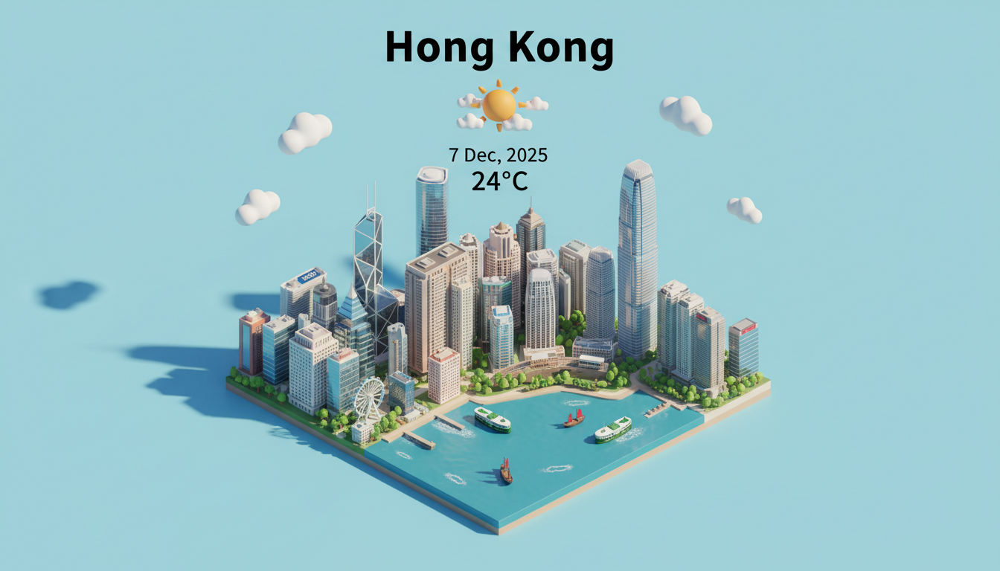

# Weather Report Generator

A powerful AI-driven application that generates visual weather reports. Leveraging Google's Gemini models, it creates realistic and informative weather snapshots based on real-time data or custom scenarios.

## Features

### 🌍 Mode 1: Real-Time Weather Visualization
*Powered by `gemini-3-pro-image-preview`*

This mode uses Google Search to fetch current weather conditions for a specified location and generates a photorealistic 3D isometric representation of the city with the current weather overlay.

*   **Live Data Integration**: Automatically retrieves real-time weather data.
*   **Visual Output**: Generates a high-quality image with city landmarks, weather icons, and temperature.

### 🎨 Mode 2: Custom Scenario Generation
*Powered by `gemini-2.5-flash-image`*

This mode allows for complete creative control, enabling you to generate weather reports for specific dates, locations, and weather conditions without relying on live data.

*   **Customizable Inputs**: Define the city, date, weather condition, and temperature manually.
*   **Creative Freedom**: Perfect for simulating future forecasts or historical weather events.

## Gallery

### Mode 1 Examples


### Mode 2 Examples




## Getting Started

### Prerequisites

*   Node.js (v18 or higher recommended)
*   A Google Cloud Project with the Gemini API enabled
*   An API Key for Gemini

### Installation

1.  Clone the repository:
    ```bash
    git clone https://github.com/normankong/weather-report.git
    cd weather-report
    ```

2.  Install dependencies:
    ```bash
    npm install
    ```

3.  Configure environment variables:
    Create a `.env` file in the root directory and add the following:

    ```env
    # Common
    GEMINI_API_KEY=your_api_key_here
    
    # Mode 1 Configuration
    CITY="Hong Kong"
    LOCATION="Hong Kong, Victoria Harbour"

    # Mode 2 Configuration
    DATE="7 Dec, 2025"
    WEATHER="Sunny"
    TEMPERATURE="25"
    ```

## Usage

### Run Mode 1 (Real-Time)
Generates a weather report based on the current weather for the `CITY` and `LOCATION` specified in `.env`.

```bash
npm run dev1
```

### Run Mode 2 (Custom)
Generates a weather report with additional parameters (`DATE`, `WEATHER`, `TEMPERATURE`) specified in `.env`.

```bash
npm run dev2
```

## Output

Generated images will be saved in the `output/YYYY-MM-DD/` directory.